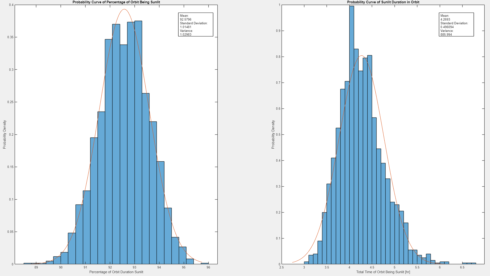

# Orbital-Shadow-Monte-Carlo
Note: still work in progress

MATLAB script that takes mean and 3sigma standard deviation values for classical orbital elements (COEs). Then uses Monte Carlo Method to disperse orbital elements, numerically simulates each trajectory, and computes the time spent in sun versus shadow to create a statistical distribution of sunlit time based on possible variation in COEs.

To run: download this repository and run SolarMonteCarlo.m using MATLAB. Code specifies input variables for simulation at top of file.

## Example Set of Results

### Plot of Nominal Orbit Along with Dispersed Cases

### Probability Distributions of Resulting Time spent in Sunlight

### Probability Distributions of Dispersed Orbital Elements

### Table of Statistical Results

